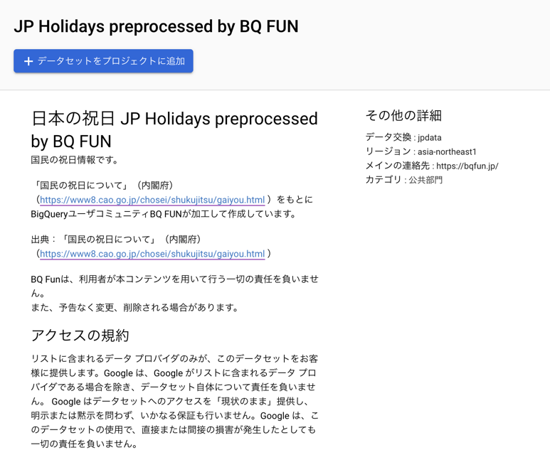

国民の祝日を閲覧できるBigQueryテーブルを作成し、[JP Holidays preprocessed by BQ FUN - Analytics Hub](https://console.cloud.google.com/bigquery/analytics-hub/exchanges/projects/120299025068/locations/asia-northeast1/dataExchanges/jpdata_18253a34a30/listings/jp_holidays_preprocessed_by_bq_fun_18253c4e9dc)で公開しました。
自身の所有するGoogle Cloudプロジェクトの、BigQueryデータセットとしてリンクできます。

「国民の祝日について」（内閣府）（https://www8.cao.go.jp/chosei/shukujitsu/gaiyou.html ）を加工して作成しています。

Google Cloud上で、Scheduler、Workflows、Functionsを使って、更新されます。
Terraformコードは[こちら](https://github.com/bqfun/jpdata/blob/main/terraform/environments/prod/main.tf#L19-L30)から確認できます。

BQ Funは、利用者が本コンテンツを用いて行う一切の責任を負いません。 また、予告なく変更、削除される場合があります。

出典：「国民の祝日について」（内閣府）（https://www8.cao.go.jp/chosei/shukujitsu/gaiyou.html ）
