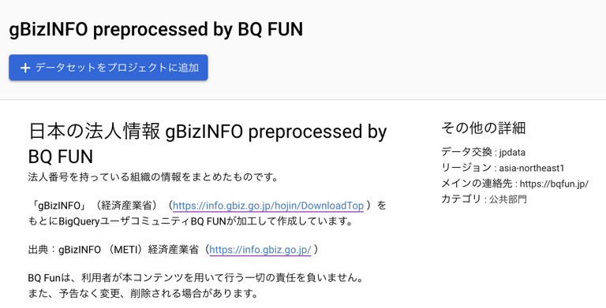

gBizINFOの、法人番号のついた組織について情報を閲覧できるBigQueryテーブルを作成し、[gBizINFO preprocessed by BQ FUN - Analytics Hub](https://console.cloud.google.com/bigquery/analytics-hub/exchanges/projects/120299025068/locations/asia-northeast1/dataExchanges/jpdata_18253a34a30/listings/gbizinfo_preprocessed_by_bq_fun_18253b3389d)で公開しました。
Analytics Hubを通して、自身の所有するGoogle Cloudプロジェクトの、BigQueryデータセットとしてリンクできます。

「gBizINFO」（経済産業省）（https://info.gbiz.go.jp/hojin/DownloadTop ）を加工して作成しています。
CSVダウンロードデータであり、gBizINFOで公開されている最新情報を閲覧できます。

Google Cloud上で、Scheduler、Workflows、Functionsを使って、更新されます。
Terraformコードは[こちら](https://github.com/bqfun/jpdata/blob/42d140912feb5a8f4244d6e7cd6c4e479a871c2a/terraform/environments/prod/main.tf#L6-L17)から確認できます。

BQ FUNは、利用者が本コンテンツを用いて行う一切の責任を負いません。 また、予告なく変更、削除される場合があります。

出典：「gBizINFO」（経済産業省）（https://info.gbiz.go.jp/ ）
