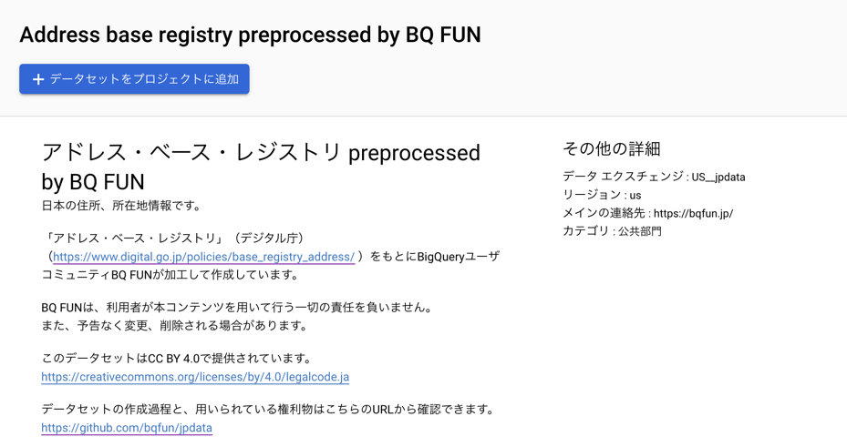
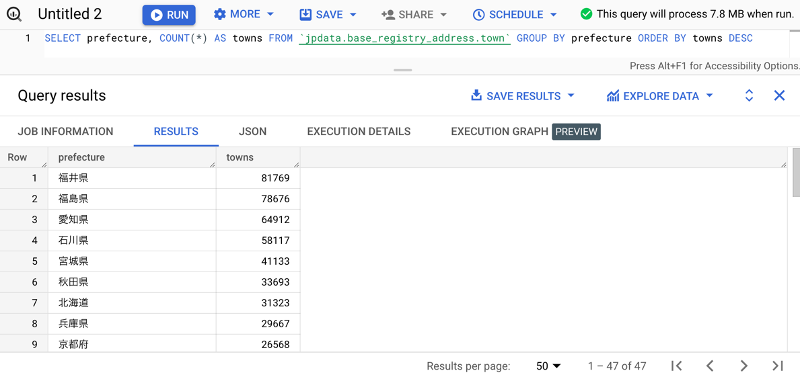

アドレス・ベース・レジストリ（デジタル庁）の、住所、所在地情報を閲覧できる BigQuery テーブルを作成し、Analytics Hub にて公開しました。

USマルチリージョン、asia-northeast1リージョン向けにそれぞれ公開しています。
- [US](https://console.cloud.google.com/bigquery/analytics-hub/exchanges(analyticshub:projects/jpdata/locations/us/dataExchanges/us_jpdata_1877561be8d/listings/base_registry_address_preprocessed_by_bq_fun_123456789ab))
- [asia-northeast1](https://console.cloud.google.com/bigquery/analytics-hub/exchanges(analyticshub:projects/jpdata/locations/asia-northeast1/dataExchanges/jpdata_18253a34a30/listings/base_registry_address_preprocessed_by_bq_fun_123456789ab))

Analytics Hub を通して、自身の所有する Google Cloud プロジェクトの、BigQuery データセットとしてリンクできます。
他にもいくつかのデータを公開しており、https://bqfun.jp/docs/jpdata から確認できます。



このデータは「アドレス・ベース・レジストリ」（デジタル庁）（https://www.digital.go.jp/policies/base_registry_address/ ）を加工して作成しています。
このデータは都道府県、市区町村、町字単位のマスターデータとしての利用を想定されており、手元のデータの整理や集計を助けてくれるはずです。



このプロジェクトでは、オープンデータをオープンプロセスで加工して提供することを目標としており、 コードは [GitHub](https://github.com/bqfun/jpdata/blob/dc28e7b25cd71c41d89ca8d36a046ab00094ea05/terraform/modules/base_registry_address/main.tf) から確認できます。
コードは概ね次のように加工プロセスを定義し、内部では Cloud Scheduler、Cloud Workflows、Cloud Run、Cloud Storage、BigQuery が使われています。

```terraform
module "main" {
  source         = "../../modules/workflows_http_to_bigquery_datasets"
  name           = "base_registry_address"
  tweakle_cpu    = "0.08"
  tweakle_memory = "512Mi"
  etlt = [
    {
      name = "pref"
      extraction = {
        url = "https://catalog.registries.digital.go.jp/rsc/address/mt_pref_all.csv.zip"
      }
      tweaks = [
        {
          call = "unzip"
        }
      ]
      transformation = {
        fields = [
          "local_government_code",
          "prefecture",
          "prefecture_kana",
          "prefecture_en",
          "effective_from",
          "effective_to",
          "remarks",
        ]
        query = <<-EOF
        CREATE OR REPLACE TABLE $${table}(
          local_government_code STRING OPTIONS(description="全国地方公共団体コード"),
          prefecture STRING OPTIONS(description="都道府県名"),
          prefecture_kana STRING OPTIONS(description="都道府県名_カナ"),
          prefecture_en STRING OPTIONS(description="都道府県名_英字"),
          effective_from DATE OPTIONS(description="効力発生日"),
          effective_to DATE OPTIONS(description="廃止日"),
          remarks STRING OPTIONS(description="備考"),
        )
        OPTIONS(
          description="https://catalog.registries.digital.go.jp/rsc/address/mt_pref_all.csv.zip",
          friendly_name="日本 都道府県マスター データセット",
          labels=[
            ("freshness", "daily")
          ]
        )
        AS
        SELECT
          local_government_code,
          prefecture,
          prefecture_kana,
          prefecture_en,
          PARSE_DATE("%Y-%m-%d", effective_from) AS effective_from,
          PARSE_DATE("%Y-%m-%d", effective_to) AS effective_to,
          remarks,
        FROM
          $${staging}
        EOF
      }
    }
  ]
}
```

注意書き

BQ FUNは、利用者が本コンテンツを用いて行う一切の責任を負いません。 また、予告なく変更、削除される場合があります。

出典：「アドレス・ベース・レジストリ」（デジタル庁）（https://www.digital.go.jp/policies/base_registry_address/ ）
